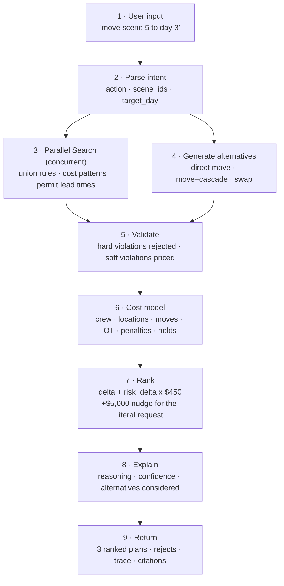

<div align="center">

# 🎬 Production Change Agent

### AI-powered film production scheduling assistant

**_"Every schedule change has a price. We tell you what it is before you commit."_**

[](https://production-change-oqvj.vercel.app/)
[](LICENSE)


<sub>Built for **Agentic Cinema: The Blockbuster Hackathon** · September 2026</sub>

</div>

---

<!-- Add a screen recording here: drop demo.gif in a docs/ folder and update this path -->
<div align="center">
  
</div>

---

## 📌 Table of Contents

- [The Problem](#-the-problem)
- [The Solution](#-the-solution)
- [Features](#-features)
- [How It Works](#-how-it-works)
- [Architecture](#️-architecture)
- [Tech Stack](#️-tech-stack)
- [Quick Start](#-quick-start)
- [Environment Variables](#-environment-variables)
- [API Reference](#-api-reference)
- [Project Structure](#-project-structure)
- [Testing](#-testing)
- [Deployment](#-deployment)
- [FAQ](#-faq)
- [Team](#-team)
- [License](#-license)

---

## 🎯 The Problem

Film production schedules are brittle. One change — moving a scene, swapping a cast member, shifting a location — cascades through the entire shoot:

| Impact | Example |
| :-- | :-- |
| 💸 **Cost overruns** | Overtime, hold days, company moves |
| ⚖️ **Union violations** | Turnaround time, meal penalties (SAG-AFTRA, IATSE) |
| 🚧 **Logistics failures** | Permit lead times, location and actor availability |

Production managers make these calls **dozens of times a week**, usually on intuition and a whiteboard. A single bad call can cost six figures.

## 💡 The Solution

Type the change in plain English. The agent generates alternative schedules, validates them against union rules, prices them with a deterministic cost model, and hands you **three ranked plans** with reasoning, confidence scores, and citations.

```
You:   "move scene 5 to day 3"

Agent: Plan #1 — Move + cascade      $340,000   (−$28,650)   87% confident
       Plan #2 — Direct move         $352,400   (−$16,250)   74% confident
       Plan #3 — Swap with scene 9   $361,100   ( −$7,550)   61% confident

       2 plans rejected: Riverside Alley unavailable · Day 5 exceeds 14h cap
```

---

## ✨ Features

| | Feature | What it does |
| :-: | :-- | :-- |
| 💬 | **Natural language input** | `move scene 5 to day 3` — no forms, no dropdowns |
| 🧠 | **Live agent trace** | Watch the chain of thought stream in over SSE |
| 📊 | **3 ranked plans** | Full cost breakdown, line by line |
| ❓ | **Plan reasoning** | Every plan explains *why* it was chosen |
| 📈 | **Confidence scores** | 0–100% certainty + alternatives considered |
| 🎞️ | **Stripboard view** | Industry-standard schedule grid, updates in real time |
| 🔍 | **Parallel Search** | Grounds decisions in real union rules and cost data |
| 🧮 | **Deterministic cost model** | Same request → same number, every time |
| ⚠️ | **Violation detection** | Flags hard/soft breaches and marks pre-existing ones |
| 🔀 | **Compare view** | Side-by-side table of all plans |
| 📄 | **PDF export** | Ship any plan to the production office |
| 🗂️ | **Agent memory** | Learns whether you optimise for cost or for compliance |

---

## 🔄 How It Works



**The ranking formula**

```python
risk_adjusted_cost = cost_delta + (risk_delta * 450) - literal_request_nudge
# risk_delta   : change in weighted violation score
# $450         : internal price of one risk point
# nudge ($5k)  : tie-breaker favouring the change the user actually asked for
```

---

## 🏗️ Architecture

```
┌──────────────────────────────────────────────────────────────┐
│  FRONTEND — React 18 + Vite + Tailwind        (Vercel)       │
│  Stripboard  │  Agent Trace  │  Plan Cards  │  Compare View  │
└──────────────────────────────────────────────────────────────┘
                        │  HTTP / SSE
                        ▼
┌──────────────────────────────────────────────────────────────┐
│  BACKEND — FastAPI (Python 3.11)              (Vercel)       │
│  /change  ·  /change/stream  ·  /schedule  ·  /health        │
└──────────────────────────────────────────────────────────────┘
            │                                  │
            ▼                                  ▼
┌───────────────────────────┐    ┌─────────────────────────────┐
│  CORE LOGIC               │    │  EXTERNAL                   │
│  parser · validator       │    │  Parallel Search API        │
│  cost_model · generate    │    │  Google Gemini (fallback)   │
└───────────────────────────┘    └─────────────────────────────┘
```

---

## 🛠️ Tech Stack

| Layer | Technology |
| :-- | :-- |
| **Frontend** | React 18 · Vite · Tailwind CSS |
| **Backend** | FastAPI · Python 3.11+ · Pydantic |
| **Search** | Parallel Search API |
| **LLM** | Google Gemini *(fallback intent parser)* |
| **Hosting** | Vercel (frontend **and** backend) |
| **Export** | jsPDF |
| **Tests** | pytest · Vitest |

---

## 🚀 Quick Start

### Prerequisites

- Python **3.11+**
- Node.js **18+**
- A [Parallel API key](https://platform.parallel.ai) *(free credits available)*

### 1. Clone

```bash
git clone https://github.com/tahreem03-hub/production-change-agent.git
cd production-change-agent
```

### 2. Backend

```bash
cd backend
python -m venv venv
source venv/bin/activate          # Windows: venv\Scripts\activate
pip install -r requirements.txt
cp .env.example .env              # then add your keys
uvicorn app.main:app --reload --port 8000
```

### 3. Frontend

```bash
cd frontend
npm install
echo "VITE_API_URL=http://localhost:8000" > .env
npm run dev
```

Open **http://localhost:5173** and try `move scene 5 to day 3`.

> 💡 **No API key?** Set `DEMO=1` in `backend/.env` to run fully offline on fixtures.

---

## 🔐 Environment Variables

### Backend

| Variable | Required | Default | Purpose |
| :-- | :-: | :-- | :-- |
| `PARALLEL_API_KEY` | ✅ | — | Parallel Search API key |
| `GEMINI_API_KEY` | ⬜ | — | Gemini fallback parser |
| `ALLOWED_ORIGINS` | ⬜ | `*` | CORS origins (comma-separated) |
| `DEMO` | ⬜ | `0` | `1` = offline mode, no API calls |

### Frontend

| Variable | Required | Purpose |
| :-- | :-: | :-- |
| `VITE_API_URL` | ✅ | Base URL of the backend |

---

## 📡 API Reference

| Endpoint | Method | Description |
| :-- | :-: | :-- |
| `/change` | `POST` | Submit a change request → ranked plans |
| `/change/stream` | `POST` | SSE stream of the live agent trace |
| `/schedule` | `GET` | Current stripboard data |
| `/health` | `GET` | Liveness + Parallel Search status |

<details>
<summary><b>Example — POST /change</b></summary>

**Request**

```json
{
  "request": "move scene 5 to day 3",
  "max_plans": 3,
  "use_search": true
}
```

**Response** *(truncated)*

```json
{
  "status": "ok",
  "baseline_cost": 368650,
  "intent": { "action": "move", "scene_ids": ["5"], "target_day": 3 },
  "plans": [
    {
      "rank": 1,
      "strategy": "move_and_cascade",
      "summary": "Move scene 5 to Day 3 and push the lightest work off that day",
      "reasoning": "Saves $28,650 by reducing overtime and hold costs. Violations drop from 8 to 5.",
      "confidence": 0.87,
      "alternatives_considered": 12,
      "cost": 340000,
      "risk_delta": -49,
      "changes": [
        { "scene_id": "5", "action": "move", "from_day": 4, "to_day": 3 }
      ],
      "violations": [
        {
          "code": "TURNAROUND",
          "severity": "soft",
          "day": 5,
          "message": "Only 9.0h turnaround into Day 5",
          "preexisting": true
        }
      ],
      "cost_breakdown": {
        "baseline_total": 368650,
        "plan_total": 340000,
        "delta": -28650,
        "lines": [
          { "label": "Company moves", "amount": -6500 },
          { "label": "Crew overtime", "amount": -8400 }
        ]
      },
      "parallel_results": [
        {
          "url": "https://...",
          "title": "SAG-AFTRA Turnaround Rules",
          "relevance": "union_rules"
        }
      ]
    }
  ],
  "rejected": [
    {
      "strategy": "alternative_day_5",
      "cost": 41200,
      "reasons": ["Riverside Alley is unavailable", "Day 5 exceeds 14h hard cap"]
    }
  ],
  "trace": [
    "Parsed intent: move ['5'] -> day 3",
    "Searching production precedent with Parallel AI...",
    "Generating alternative schedules...",
    "Generated 3 viable plans, 2 rejected",
    "Plan #1 recommended as optimal (confidence 87%)"
  ],
  "search_used": true,
  "elapsed_ms": 812
}
```

</details>

---

## 📁 Project Structure

<details>
<summary><b>Expand tree</b></summary>

```
production-change-agent/
├── frontend/
│   ├── src/
│   │   ├── components/
│   │   │   ├── AgentTrace.jsx        # Chain-of-thought terminal
│   │   │   ├── AgentThinking.jsx     # Streaming loading states
│   │   │   ├── ChangeInput.jsx       # Natural language input
│   │   │   ├── PlanCard.jsx          # Plan + reasoning + confidence
│   │   │   ├── CompareView.jsx       # Side-by-side comparison
│   │   │   ├── SourceList.jsx        # Parallel Search citations
│   │   │   ├── Stripboard.jsx        # Schedule grid
│   │   │   └── ViolationBadges.jsx   # Rule violation display
│   │   ├── App.jsx
│   │   └── api.js
│   ├── package.json
│   └── vercel.json
│
├── backend/
│   ├── app/
│   │   ├── main.py                   # FastAPI entry point
│   │   ├── schemas.py                # Pydantic models
│   │   ├── tools.py                  # Parallel Search client
│   │   ├── parser.py                 # NL → intent
│   │   ├── generate.py               # Plan generation & ranking
│   │   ├── validator.py              # Union rule validation
│   │   ├── cost_model.py             # Deterministic pricing
│   │   └── config.py                 # Env + data loading
│   ├── data/production.json          # Sample production
│   ├── tests/test_api.py
│   ├── requirements.txt
│   └── vercel.json
│
├── demo/demo_script.md
├── LICENSE
└── README.md
```

</details>

---

## 🧪 Testing

```bash
# Backend
cd backend && pytest tests/ -v

# Frontend
cd frontend && npm test
```

| Input | Expected |
| :-- | :-- |
| `move scene 5 to day 3` | `200` — 3 plans with trace, reasoning, confidence |
| `delete scene 999` | `404` — *Unknown scene* |
| `fix the schedule` | `422` — unparseable, returns example phrasing |
| `DEMO=1` | Runs on fixtures, zero external calls |

---

## 🚢 Deployment

Both apps ship to **Vercel** from the same repo as two separate projects.

### Backend (FastAPI on Vercel)

`backend/vercel.json`:

```json
{
  "builds": [{ "src": "app/main.py", "use": "@vercel/python" }],
  "routes": [{ "src": "/(.*)", "dest": "app/main.py" }]
}
```

```bash
cd backend
vercel --prod
```

Then set the env vars in **Project → Settings → Environment Variables**:

```
PARALLEL_API_KEY = your_key
ALLOWED_ORIGINS  = https://production-change-oqvj.vercel.app
```

> ⚠️ Vercel's Python runtime is serverless. Keep `/change` under the function timeout (10s on Hobby, 60s on Pro) — the agent runs search and generation concurrently to stay well inside it.

### Frontend (Vite on Vercel)

```bash
cd frontend
vercel --prod
```

| Setting | Value |
| :-- | :-- |
| Framework preset | Vite |
| Build command | `npm run build` |
| Output directory | `dist` |
| Env var | `VITE_API_URL = <your backend Vercel URL>` |

Connect the GitHub repo for automatic preview deploys on every push.

---

## 🎥 Demo Script (3 min)

| Time | Beat |
| :-- | :-- |
| 0:00 | Title + tagline |
| 0:15 | The problem — show the tangled schedule |
| 0:30 | Type `move scene 5 to day 3` |
| 0:45 | Agent trace streams in |
| 1:15 | Three ranked plans with costs |
| 1:45 | Expand a plan → *"Why this plan?"* |
| 2:00 | Compare view |
| 2:15 | Select a plan → stripboard updates live |
| 2:30 | **"This saves $28,650. What would you have decided?"** |
| 2:45 | Tagline + CTA |

---

## ❓ FAQ

<details>
<summary><b>Do I need a Parallel API key?</b></summary>
For live search, yes — free credits at <a href="https://platform.parallel.ai">platform.parallel.ai</a>. To just try the app, set <code>DEMO=1</code>.
</details>

<details>
<summary><b>How does Parallel Search fit in?</b></summary>
It runs <em>concurrently</em> with schedule generation, retrieving union rules, rescheduling cost patterns and permit lead times. Results are attached to each plan as citations, so every recommendation is traceable to a source.
</details>

<details>
<summary><b>Are the costs realistic?</b></summary>
They come from a deterministic model using industry-standard rates for crew, locations, company moves and union penalties. Same request → same number, always. It's a decision-support tool, not a replacement for your line producer.
</details>

<details>
<summary><b>Why serverless instead of a long-running container?</b></summary>
The agent loop is bounded — parse, search, generate, validate, cost, rank. It finishes in under a second on the sample production, which fits Vercel's function model cleanly and keeps hosting free.
</details>

<details>
<summary><b>What's the agent trace?</b></summary>
A step-by-step log of the agent's reasoning, streamed over SSE from parse to final recommendation. It's there so you can audit the decision, not just accept it.
</details>

---

## 🗺️ Roadmap

- [ ] Import real stripboards from Movie Magic / Scenechronize
- [ ] Weather and daylight constraints for exterior scenes
- [ ] Multi-change requests (`"move 5 to day 3 and drop scene 12"`)
- [ ] Team mode — shared plans with comments and approvals
- [ ] Fine-grained union rulesets per region

---

## 👥 Team

Built together, end to end — agent loop, cost model, validation, and UI.

| | Links |
| :-- | :-- |
| **Tahreem Noor** | [LinkedIn](https://www.linkedin.com/in/tahreem-noor-86320736a) · [GitHub](https://github.com/tahreem03-hub) |
| **Khadijah Naveed** | [LinkedIn](https://www.linkedin.com/in/khadijah-naveed-695976344/) · [GitHub](https://github.com/KhadijahNaveed) |

---

## 🤝 Credits

**Parallel AI** — search credits · **FastAPI** · **React + Vite** · **Tailwind CSS** · **Vercel**

## 📝 License

Apache — see [LICENSE](LICENSE).

---

<div align="center">

[](https://production-change-oqvj.vercel.app/)
[](https://devpost.com/software/YOUR-PUBLIC-PROJECT-SLUG)

<sub>Built for Agentic Cinema: The Blockbuster Hackathon · September 2026</sub>

</div>
